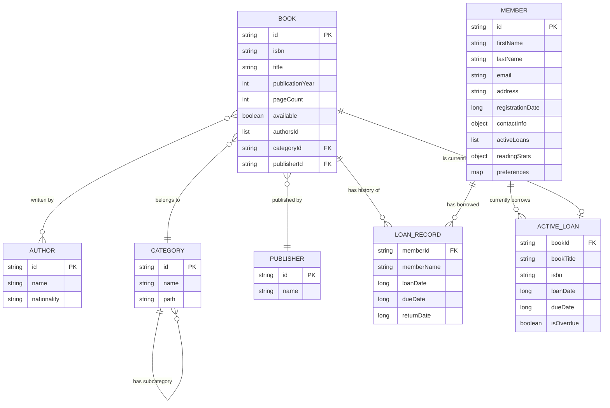

# Comparaison entre MongoDB et RavenDB

```
docker run --name mongo-community -p 27017:27017 -d mongodb/mongodb-community-server:latest
```

```
docker run -d --name ravendb -p 8080:8080 -p 38888:38888 -v ravendb-data:/opt/RavenDB/Server/RavenData ravendb/ravendb:latest
```

# MERISE Data Dictionary and NoSQL Database Design for a Library System

## 1. Dictionnaire de Données MERISE

### Entité AUTHOR
| Propriété | Description | Format | Type | Identifiant | Contraintes |
|-----------|-------------|--------|------|-------------|-------------|
| id | Identifiant unique de l'auteur | Chaîne alphanumérique | String | Oui (Clé primaire) | Non null, Unique |
| name | Nom complet de l'auteur | Chaîne de caractères | String | Non | Non null |
| nationality | Nationalité de l'auteur | Chaîne de caractères | String | Non | Peut être null |

### Entité CATEGORY
| Propriété | Description | Format | Type | Identifiant | Contraintes |
|-----------|-------------|--------|------|-------------|-------------|
| id | Identifiant unique de la catégorie | Chaîne alphanumérique | String | Oui (Clé primaire) | Non null, Unique |
| name | Nom de la catégorie | Chaîne de caractères | String | Non | Non null |
| path | Chemin hiérarchique (ex: "Fiction/Science Fiction") | Chaîne de caractères | String | Non | Non null |

### Entité BOOK
| Propriété | Description | Format | Type | Identifiant | Contraintes |
|-----------|-------------|--------|------|-------------|-------------|
| id | Identifiant unique du livre | Chaîne alphanumérique | String | Oui (Clé primaire) | Non null, Unique |
| isbn | Numéro ISBN du livre | Chaîne alphanumérique | String | Non | Unique |
| title | Titre du livre | Chaîne de caractères | String | Non | Non null |
| publicationYear | Année de publication | Numérique | int | Non | > 0 |
| pageCount | Nombre de pages | Numérique | int | Non | > 0 |
| available | Disponibilité du livre | Booléen | boolean | Non | Non null |
| authorsId | Liste des identifiants d'auteurs | Liste de chaînes | List<String> | Non | Peut être vide |
| categoryId | Identifiant de la catégorie | Chaîne alphanumérique | String | Non | Référence CATEGORY |
| publisherId | Identifiant de l'éditeur | Chaîne alphanumérique | String | Non | Référence PUBLISHER |
| loanHistory | Historique des emprunts | Collection | List<LoanRecord> | Non | Peut être vide |
| metadata | Métadonnées supplémentaires | Map | Map<String, Object> | Non | Peut être null |

### Entité PUBLISHER
| Propriété | Description | Format | Type | Identifiant | Contraintes |
|-----------|-------------|--------|------|-------------|-------------|
| id | Identifiant unique de l'éditeur | Chaîne alphanumérique | String | Oui (Clé primaire) | Non null, Unique |
| name | Nom de l'éditeur | Chaîne de caractères | String | Non | Non null |

### Entité MEMBER
| Propriété | Description | Format | Type | Identifiant | Contraintes |
|-----------|-------------|--------|------|-------------|-------------|
| id | Identifiant unique du membre | Chaîne alphanumérique | String | Oui (Clé primaire) | Non null, Unique |
| firstName | Prénom du membre | Chaîne de caractères | String | Non | Non null |
| lastName | Nom de famille du membre | Chaîne de caractères | String | Non | Non null |
| email | Adresse email | Chaîne de caractères | String | Non | Non null, Format email |
| address | Adresse postale | Chaîne de caractères | String | Non | Peut être null |
| registrationDate | Date d'inscription (timestamp) | Numérique | long | Non | Non null |
| contactInfo | Informations de contact | Objet imbriqué | ContactInfo | Non | Peut être null |
| activeLoans | Emprunts actifs | Collection | List<ActiveLoan> | Non | Peut être vide |
| readingStats | Statistiques de lecture | Objet imbriqué | ReadingStats | Non | Peut être null |
| preferences | Préférences utilisateur | Map | Map<String, Object> | Non | Peut être null |

### Structure imbriquée LOAN_RECORD
| Propriété | Description | Format | Type | Identifiant | Contraintes |
|-----------|-------------|--------|------|-------------|-------------|
| memberId | Identifiant du membre | Chaîne alphanumérique | String | Non | Référence MEMBER |
| memberName | Nom du membre | Chaîne de caractères | String | Non | Non null |
| loanDate | Date d'emprunt (timestamp) | Numérique | long | Non | Non null |
| dueDate | Date d'échéance (timestamp) | Numérique | long | Non | Non null |
| returnDate | Date de retour (timestamp) | Numérique | Long | Non | Peut être null (prêt actif) |

### Structure imbriquée ACTIVE_LOAN
| Propriété | Description | Format | Type | Identifiant | Contraintes |
|-----------|-------------|--------|------|-------------|-------------|
| bookId | Identifiant du livre | Chaîne alphanumérique | String | Non | Référence BOOK |
| bookTitle | Titre du livre | Chaîne de caractères | String | Non | Non null |
| isbn | Numéro ISBN du livre | Chaîne alphanumérique | String | Non | Non null |
| loanDate | Date d'emprunt (timestamp) | Numérique | long | Non | Non null |
| dueDate | Date d'échéance (timestamp) | Numérique | long | Non | Non null |
| isOverdue | Indicateur de retard | Booléen | boolean | Non | Non null |

## 2. Description Textuelle des Associations

1. **BOOK-AUTHOR** (N:M):
   - Un BOOK peut avoir plusieurs AUTHOR (0..N)
   - Un AUTHOR peut avoir écrit plusieurs BOOK (0..N)
   - Le lien est maintenu via la liste authorsId dans l'entité BOOK

2. **BOOK-CATEGORY** (N:1):
   - Un BOOK appartient à une seule CATEGORY (1..1)
   - Une CATEGORY peut contenir plusieurs BOOK (0..N)
   - Le lien est maintenu via la propriété categoryId dans l'entité BOOK

3. **BOOK-PUBLISHER** (N:1):
   - Un BOOK est publié par un seul PUBLISHER (1..1)
   - Un PUBLISHER peut publier plusieurs BOOK (0..N)
   - Le lien est maintenu via la propriété publisherId dans l'entité BOOK

4. **BOOK-MEMBER** (via LOAN_RECORD) (N:M):
   - Un BOOK peut être emprunté par plusieurs MEMBER au fil du temps (0..N)
   - Un MEMBER peut emprunter plusieurs BOOK au fil du temps (0..N)
   - Cette relation est historisée par la collection loanHistory dans l'entité BOOK

5. **MEMBER-BOOK** (via ACTIVE_LOAN) (N:M):
   - Un MEMBER peut avoir plusieurs emprunts actifs (0..N)
   - Un BOOK peut être actuellement emprunté par un seul MEMBER (0..1)
   - Cette relation est représentée par la collection activeLoans dans l'entité MEMBER

6. **CATEGORY-CATEGORY** (Hiérarchique):
   - Une CATEGORY peut être une sous-catégorie d'une autre CATEGORY
   - Cette relation hiérarchique est représentée par la propriété path dans l'entité CATEGORY

## 3. Modèle Entité-Association MERISE


## 4. Conversion du MCD MERISE en objets MongoDB et RavenDB

### Spécification des modèles de documents pour MongoDB

1. **Collection authors**
```json
{
  "_id": ObjectId("..."),
  "name": "J.K. Rowling",
  "nationality": "British"
}
```

2. **Collection categories**
```json
{
  "_id": ObjectId("..."),
  "name": "Science Fiction",
  "path": "Fiction/Science Fiction"
}
```

3. **Collection books**
```json
{
  "_id": ObjectId("..."),
  "isbn": "9780316769480",
  "title": "The Catcher in the Rye",
  "publicationYear": 1951,
  "pageCount": 234,
  "available": true,
  "authorsId": [ObjectId("..."), ObjectId("...")],
  "categoryId": ObjectId("..."),
  "publisherId": ObjectId("..."),
  "loanHistory": [
    {
      "memberId": ObjectId("..."),
      "memberName": "John Smith",
      "loanDate": 1646006400000,
      "dueDate": 1648425600000,
      "returnDate": 1647561600000
    }
  ],
  "metadata": {
    "language": "English",
    "edition": "First Edition"
  }
}
```

4. **Collection publishers**
```json
{
  "_id": ObjectId("..."),
  "name": "Penguin Books"
}
```

5. **Collection members**
```json
{
  "_id": ObjectId("..."),
  "firstName": "John",
  "lastName": "Smith",
  "email": "john.smith@gmail.com",
  "address": "123 Main St, Anytown, USA",
  "registrationDate": 1614470400000,
  "contactInfo": {
    "phone": "555-123-4567",
    "alternateEmail": "john.work@company.com",
    "emergencyContact": {
      "name": "Jane Smith",
      "relationship": "Spouse",
      "phone": "555-765-4321"
    }
  },
  "activeLoans": [
    {
      "bookId": ObjectId("..."),
      "bookTitle": "The Great Gatsby",
      "isbn": "9780743273565",
      "loanDate": 1646006400000,
      "dueDate": 1648425600000,
      "isOverdue": false
    }
  ],
  "readingStats": {
    "totalBooksRead": 42,
    "booksReadThisYear": 7,
    "averageDaysToReturn": 14,
    "categoryPreferences": {
      "Fiction": 18,
      "Science Fiction": 12,
      "Biography": 5
    },
    "favoriteAuthors": ["ObjectId(...)", "ObjectId(...)"]
  },
  "preferences": {
    "preferredFormat": "Hardcover",
    "notificationPreferences": {
      "email": true,
      "overdueReminders": true
    },
    "favoriteSubjects": ["History", "Science"]
  }
}
```

### Spécification des modèles de documents pour RavenDB

La structure des documents dans RavenDB est similaire à MongoDB, mais avec quelques différences de convention:

1. **Collection Authors**
```json
{
  "Id": "authors/1",
  "Name": "J.K. Rowling",
  "Nationality": "British",
  "@metadata": {
    "@collection": "Authors"
  }
}
```

2. **Collection Categories**
```json
{
  "Id": "categories/1",
  "Name": "Science Fiction",
  "Path": "Fiction/Science Fiction",
  "@metadata": {
    "@collection": "Categories"
  }
}
```

3. **Collection Books**
```json
{
  "Id": "books/1",
  "Isbn": "9780316769480",
  "Title": "The Catcher in the Rye",
  "PublicationYear": 1951,
  "PageCount": 234,
  "Available": true,
  "AuthorsId": ["authors/1", "authors/2"],
  "CategoryId": "categories/1",
  "PublisherId": "publishers/1",
  "LoanHistory": [
    {
      "MemberId": "members/1",
      "MemberName": "John Smith",
      "LoanDate": 1646006400000,
      "DueDate": 1648425600000,
      "ReturnDate": 1647561600000
    }
  ],
  "Metadata": {
    "Language": "English",
    "Edition": "First Edition"
  },
  "@metadata": {
    "@collection": "Books"
  }
}
```

4. **Collection Publishers**
```json
{
  "Id": "publishers/1",
  "Name": "Penguin Books",
  "@metadata": {
    "@collection": "Publishers"
  }
}
```

5. **Collection Members**
```json
{
  "Id": "members/1",
  "FirstName": "John",
  "LastName": "Smith",
  "Email": "john.smith@gmail.com",
  "Address": "123 Main St, Anytown, USA",
  "RegistrationDate": 1614470400000,
  "ContactInfo": {
    "Phone": "555-123-4567",
    "AlternateEmail": "john.work@company.com",
    "EmergencyContact": {
      "Name": "Jane Smith",
      "Relationship": "Spouse",
      "Phone": "555-765-4321"
    }
  },
  "ActiveLoans": [
    {
      "BookId": "books/1",
      "BookTitle": "The Great Gatsby",
      "Isbn": "9780743273565",
      "LoanDate": 1646006400000,
      "DueDate": 1648425600000,
      "IsOverdue": false
    }
  ],
  "ReadingStats": {
    "TotalBooksRead": 42,
    "BooksReadThisYear": 7,
    "AverageDaysToReturn": 14,
    "CategoryPreferences": {
      "Fiction": 18,
      "Science Fiction": 12,
      "Biography": 5
    },
    "FavoriteAuthors": ["authors/1", "authors/2"]
  },
  "Preferences": {
    "PreferredFormat": "Hardcover",
    "NotificationPreferences": {
      "Email": true,
      "OverdueReminders": true
    },
    "FavoriteSubjects": ["History", "Science"]
  },
  "@metadata": {
    "@collection": "Members"
  }
}
```

## 5. Principales différences d'implémentation entre MongoDB et RavenDB

1. **Format des identifiants**:
    - MongoDB utilise des `ObjectId` générés automatiquement
    - RavenDB utilise des identifiants sous forme de chaîne avec un préfixe de collection (ex: "authors/1")

2. **Conventions de nommage**:
    - MongoDB utilise généralement le camelCase pour les propriétés
    - RavenDB utilise souvent le PascalCase (première lettre majuscule)

3. **Métadonnées**:
    - RavenDB utilise un objet `@metadata` spécial pour stocker des informations comme le nom de la collection
    - MongoDB n'a pas d'équivalent direct; les métadonnées sont souvent stockées comme champs normaux

4. **Requêtes et indexation**:
    - MongoDB utilise un système d'indexation basé sur B-tree
    - RavenDB utilise un système d'indexation basé sur Lucene/ESENT

5. **Transactions**:
    - MongoDB supporte les transactions multi-documents depuis la version 4.0
    - RavenDB a toujours eu un support complet des transactions ACID

6. **Approche de modélisation**:
    - Les deux bases de données supportent un modèle orienté document, mais RavenDB est plus strict sur la structure du document
    - MongoDB permet une plus grande flexibilité dans la structure des documents